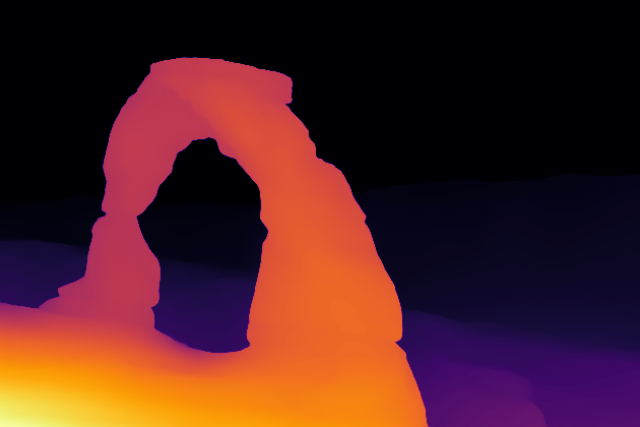

# Depth Anything V2 - Real-Time Depth Estimation

A C++ implementation for monocular depth estimation using the Depth Anything V2 neural network with OpenCV and ONNX Runtime.

## Authors

- Bruce A. Maxwell
- Claire Liu
- Yu-Jing Wei

## Overview

This project provides a simple wrapper for running Depth Anything V2 (DA2) depth estimation on images and real-time video streams. The network takes a single RGB image as input and produces a relative depth map, where pixel intensity corresponds to estimated depth.




## Features

- **Single Image Processing**: Generate depth maps from static images
- **Real-Time Video Processing**: Live depth estimation from webcam feed
- **Interactive Visualization**: Adjustable threshold to highlight distant objects
- **Flexible Scaling**: Configurable input resolution for speed/quality tradeoff
- **Color-Mapped Output**: INFERNO colormap visualization for depth maps

## Requirements

- OpenCV 4.x
- ONNX Runtime
- C++17 or later
- CMake (for building)

## Project Structure

```
DA2/
├── DA2Network.hpp      # Network wrapper class
├── da2-example.cpp     # Single image depth estimation
├── da2-video.cpp       # Real-time video depth estimation
├── model_fp16.onnx     # Pre-trained DA2 model (FP16)
├── makefile            # Build configuration
├── arch.jpeg           # Sample image
├── gull.jpeg           # Sample image
└── README.md
```

## Building

```bash
make <target>
```
Example:
```bash
make da2vid
```

Or compile manually:

```bash
# Single image example
g++ -o da2 da2-example.cpp `pkg-config --cflags --libs opencv4` -lonnxruntime

# Video example
g++ -o da2vid da2-video.cpp `pkg-config --cflags --libs opencv4` -lonnxruntime
```

## Usage

### Single Image Mode

Process a single image and display the depth map:

```bash
./da2 <image_filename>
```

Example:

```bash
./da2 arch.jpeg
```

The program will display the original image and the colorized depth map, then save the result as `depth_image.png`.

### Video Mode

Run real-time depth estimation on webcam input:

```bash
./da2vid
```

**Controls:**

- **Trackbar**: Adjust the "Farthest Redness" threshold to highlight distant objects in red
- **Q**: Quit the application

## How It Works

The DA2Network class handles:

1. **Input Preprocessing**: Resizes and normalizes the input image using ImageNet statistics
2. **Network Inference**: Runs the ONNX model using CPU execution
3. **Output Processing**: Normalizes depth values to 0-255 range and resizes to match input dimensions

### Depth Output

- **0** : Farthest from camera
- **255** : Closest to camera

Note: These are relative depth values, not metric distances.

## API Reference

### DA2Network Class

```cpp
// Constructor with default layer names
DA2Network(const char *network_path);

// Constructor with custom layer names
DA2Network(const char *network_path, const char *input_layer_name, const char *output_layer_name);

// Set input image with optional scaling
int set_input(const cv::Mat &src, const float scale_factor = 1.0);

// Run inference and get depth map
int run_network(cv::Mat &dst, const cv::Size &output_size);

// Accessors
int in_height();   // Input tensor height
int in_width();    // Input tensor width
int out_height();  // Output tensor height
int out_width();   // Output tensor width
```

## Performance Tips

- Use `scale_factor` < 1.0 for faster processing (e.g., 0.5 for half resolution)
- Minimum recommended input size: 200x200 pixels
- For video, the default reduction factor is 0.5

## License

This project uses the Depth Anything V2 model. Please refer to the original [Depth Anything repository](https://github.com/DepthAnything/Depth-Anything-V2) for model licensing information.

## Acknowledgments

- [Depth Anything V2](https://github.com/DepthAnything/Depth-Anything-V2) - Original model and research
- [ONNX Runtime](https://onnxruntime.ai/) - Inference engine
- [OpenCV](https://opencv.org/) - Image processing
