# Description
We integrates all developed filters into a single framework. The core of the system is the `Filters` class, which encapsulates each image processing process as a modular static method. The main application, `vidDisplay`, continuously captures frames from the camera and applies the selected filter based on user input. By using a state variable (`colorMode`) controlled by keyboard shortcuts, the system allows users to dynamically switch between different effects without restarting the application. This design ensures that all filters are easily accessible and testable within a single runtime environment. 

# Overview of each task
## How cvtColor work in OpenCV? (Task3)
OpenCV provides over 150 color-space coversion methods. We use the RGB -> Gray color coversion code(`cv::COLOR_RGB2GRAY`) in our project. The coversion is based on the formula listed belows. 

Transformations within RGB space like adding/removing the alpha channel, reversing the channel order, conversion to/from 16-bit RGB color (R5:G6:B5 or R5:G5:B5), as well as conversion to/from grayscale using:
$$Y \leftarrow 0.299 \cdot R + 0.587 \cdot G + 0.114 \cdot B$$
and
$$R \leftarrow Y, G \leftarrow Y, B \leftarrow Y, A \leftarrow \max(ChannelRange)$$

The original and `cvtColor::COLOR_RGB2GRAY` version images are listed below:
**Color:**
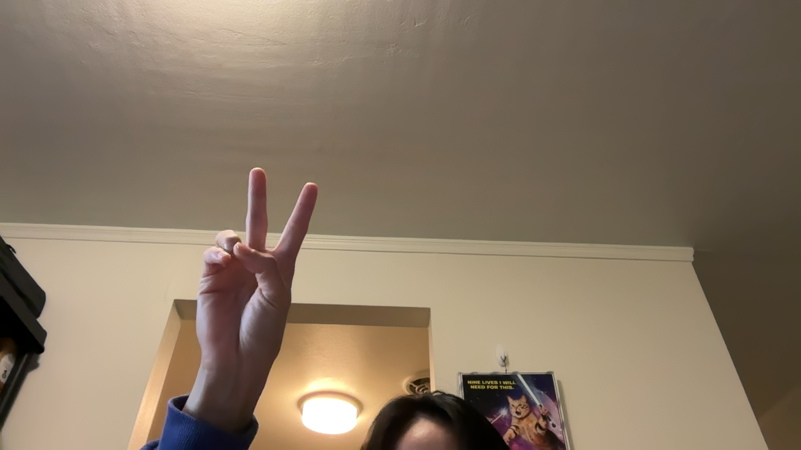
**Grey:**
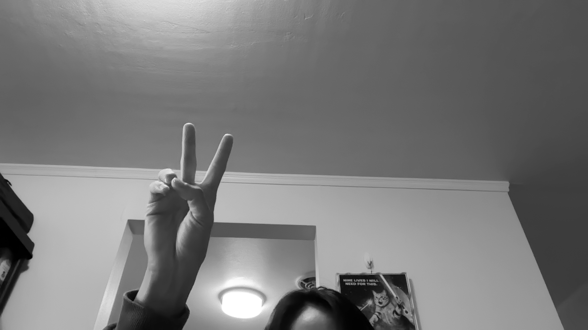

## Alternative grayscale filter (Task4)
We use weighted RGB mean for the filter. The weight is designed to mimic the true tonal perception of the human visual system. The coverison is listed below:
$$Y \leftarrow  0.32  \cdot R + 0.64 \cdot G + 0.04 \cdot B$$

**Color:**
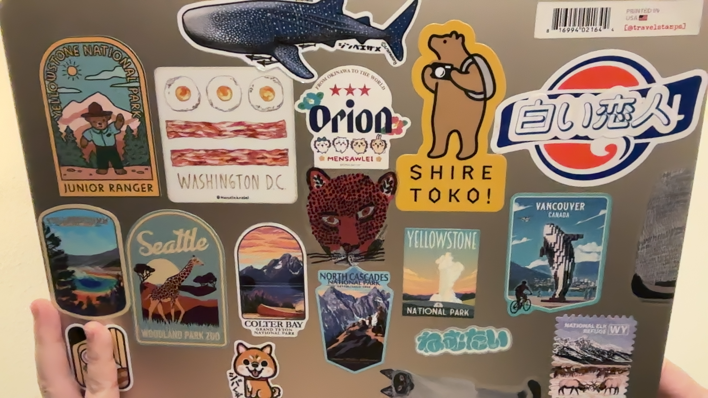
**Our gray filter:**
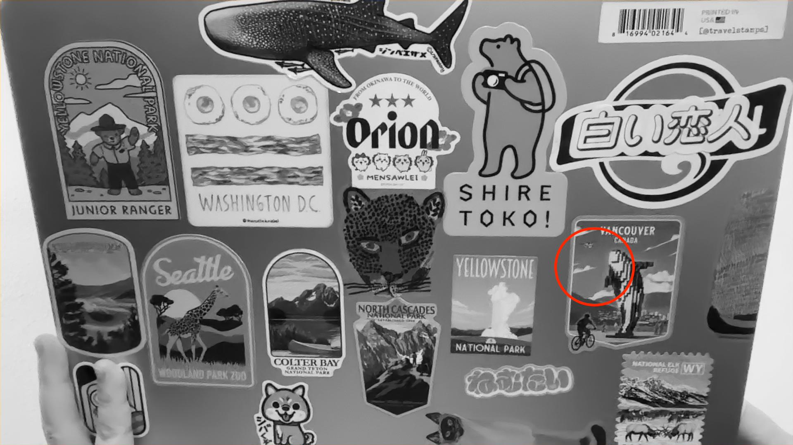
**CV's gray filter:**
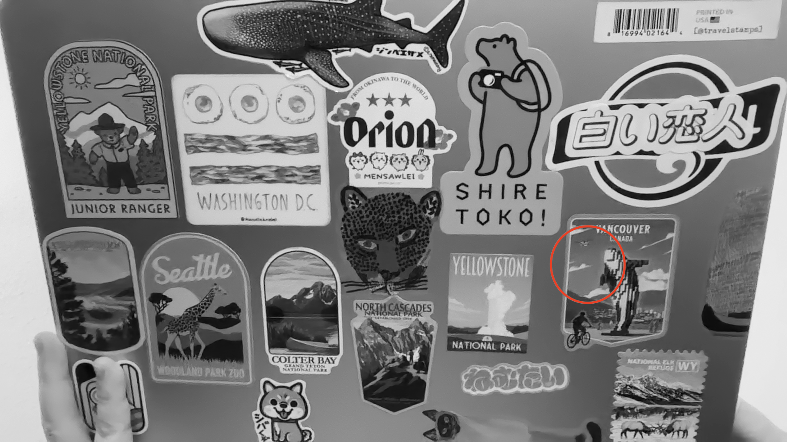

## Sepia filter (Task5)
We declare two diffrent variable to store RGB information. One set of variable store orginal RGB information and the other store the RGB information after coversion.

**Original:**
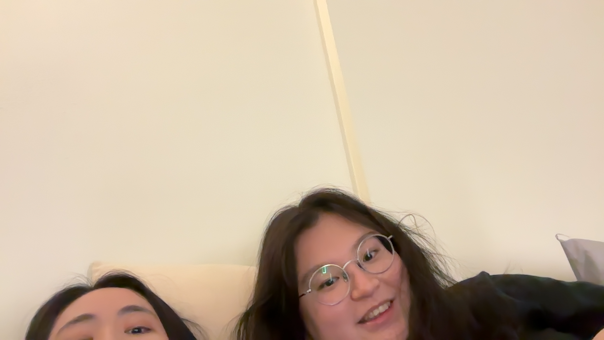
**Apply Sepia filter:**
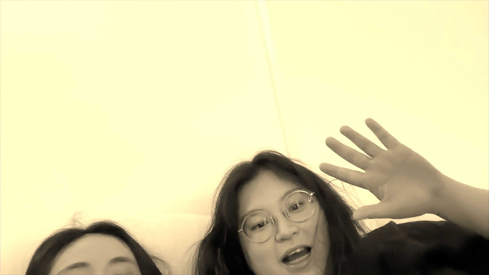
**Apply vignetting filter:**
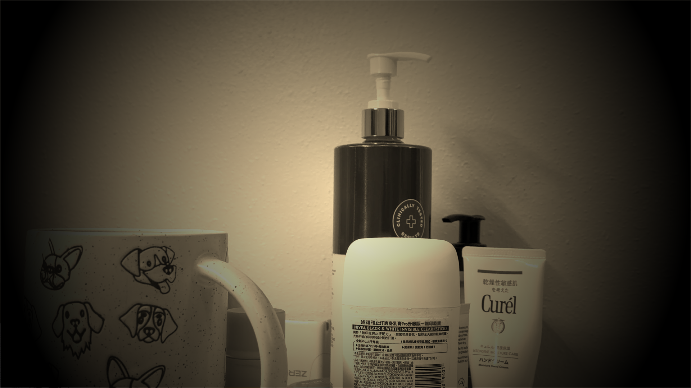

## 5x5 blur filter (Task6)
**Original:**

**Apply 5x5 blur:**
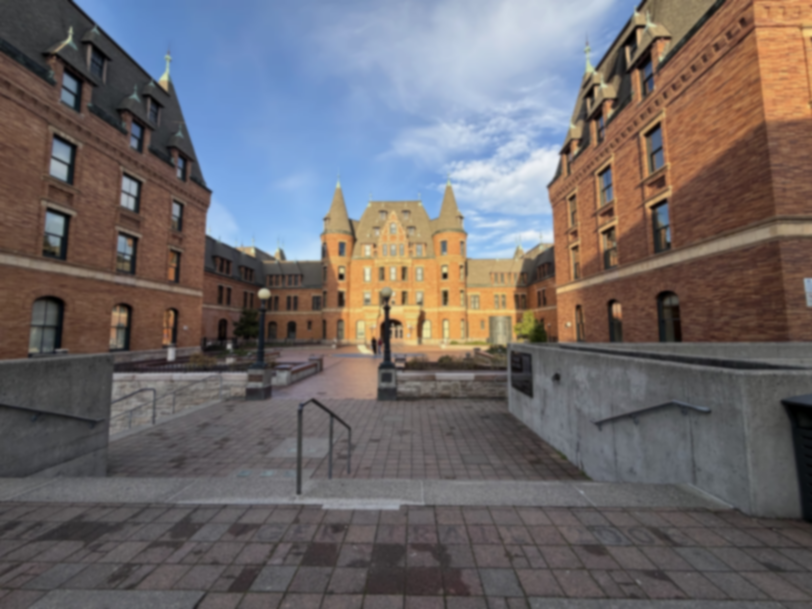
**Timing information:**

## 3x3 Sobel X and 3x3 Sobel Y (Task8)
We implment an abstract convolution function `int Filters::convolve(cv::Mat &src, cv::Mat &dst, int *kernel1, int *kernel2, int kSize, int kSum)` to process convolution with NxN seprable kernel. 

**Original:**
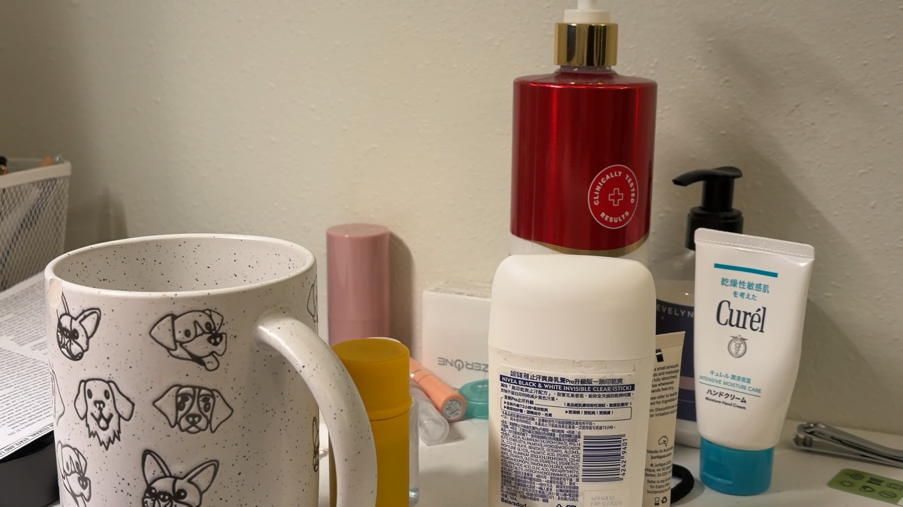
**Apply SobelX filter:**
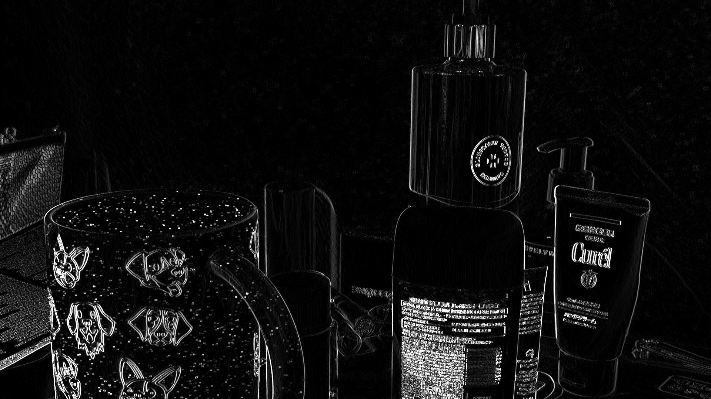
**Apply SobelY filter:**
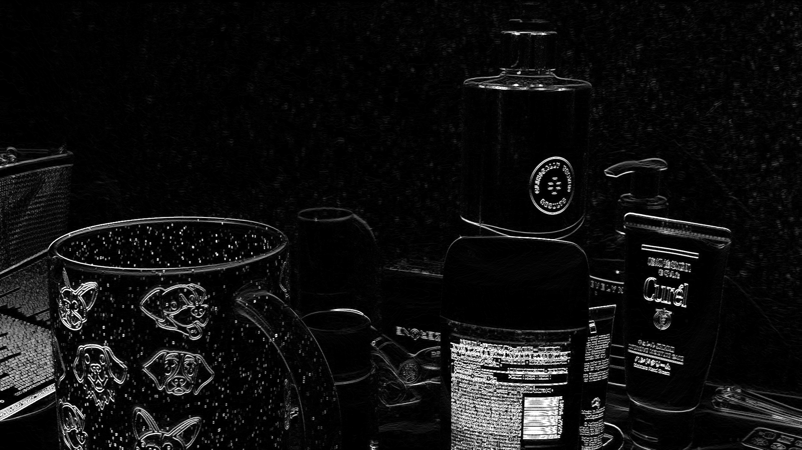
**Apply Gradient Magnitude:**
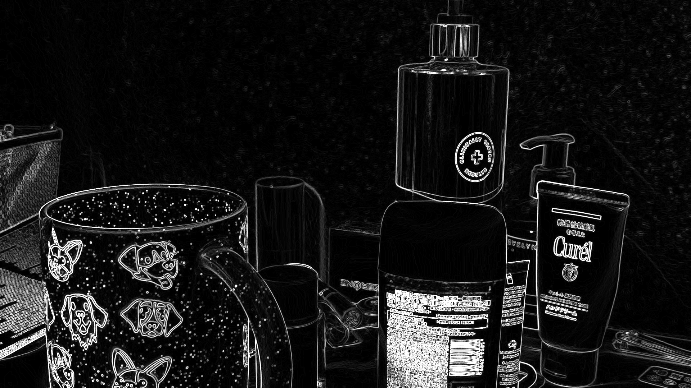

## Implement a function that blurs and quantizes a color image(Task9)
**Original:**
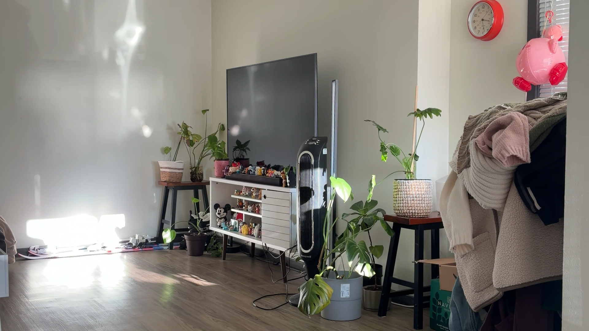
**Apply blurQuantize:**
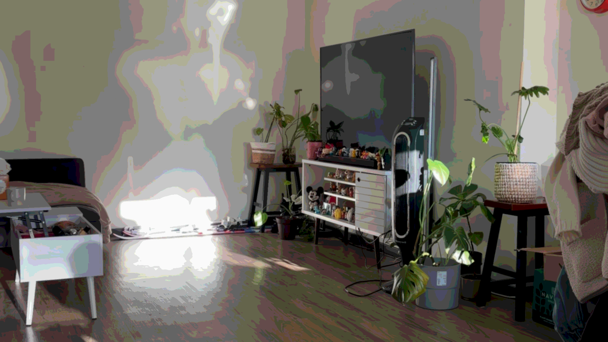

## Face detection(Task10)
**Picture with face detection**

## Depth Anything V2 network (Task11)
**DA2 works in video stream**

**Our filter**
We use DA2's picture to mark the farrest object from the camera as red.

## More effect (Task12)
### Remain yellow and grey everything else
We first transform RGB picture into HSV color and `cv::Scalar` to define the range of yellow color. Then we use `cv::inRange` to create a mask and apply it to the original image. If the pixel is not in the range of yellow, we assign it to grey.

**Original:**
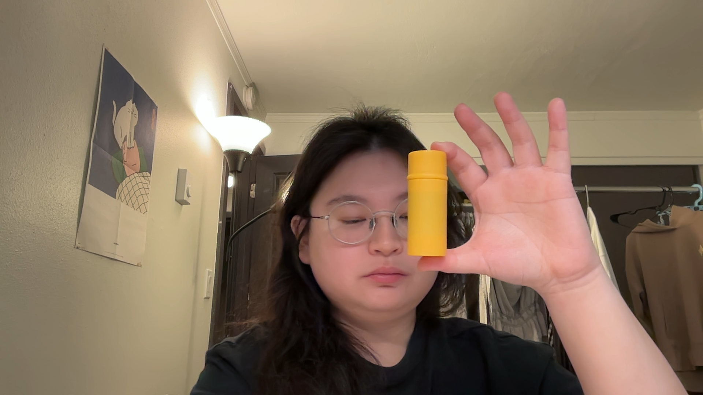
**Apply filter:**
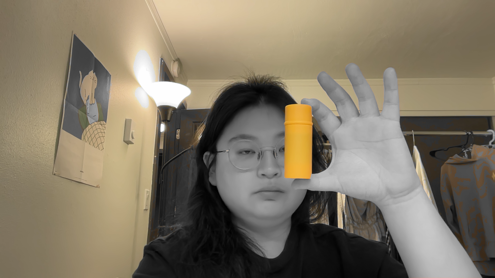

# Reflection

# Acknowlegdement
In this project, we referred to the OpenCV official documentation to understand and implement the required image processing methods. In addition, we used ChatGPT and Google Gemini to assit us code up our idea and debug.
