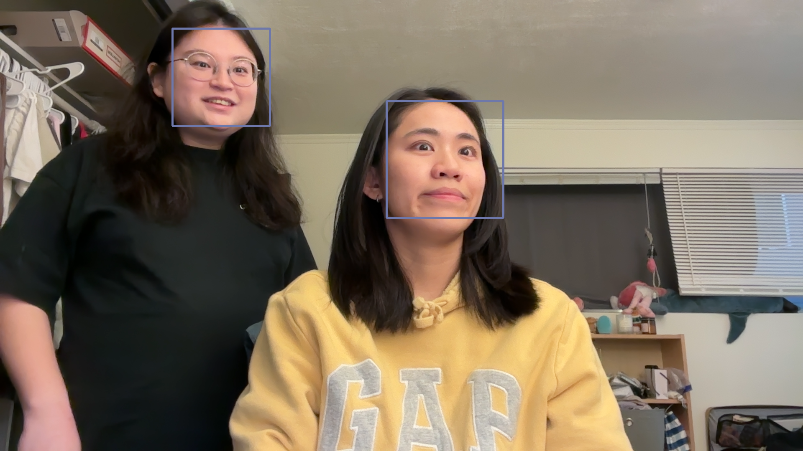
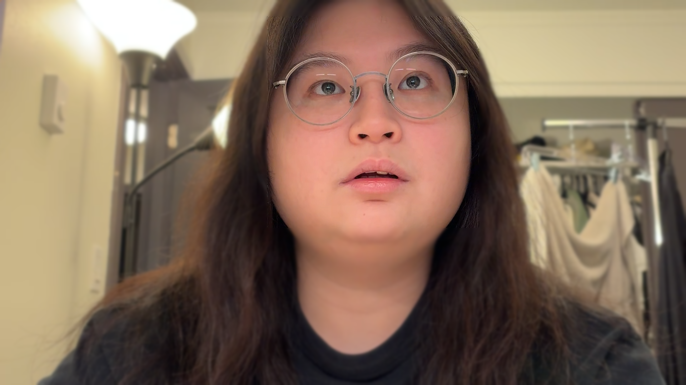
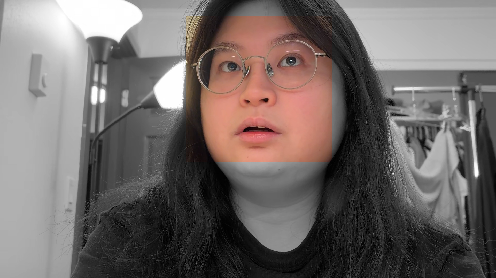

# Project 1: Video-special effects
## Team Members
Claire Liu, Yu-Jing Wei

## Github repo link
https://github.com/Happy1HappyHappy/CS5330-Computer-Vision/tree/main/project1

## Description
We integrates all developed filters into a single framework. The core of the system is the `Filters` class, which encapsulates each image processing process as a modular static method. The main application, `vidDisplay`, continuously captures frames from the camera and applies the selected filter based on user input. By using a state variable (`colorMode`) controlled by keyboard shortcuts, the system allows users to dynamically switch between different effects without restarting the application. This design ensures that all filters are easily accessible and testable within a single runtime environment. 

## Overview of each task
### OpenCV Greyscale Filter (Task3)
#### How cvtColor work in OpenCV? 
OpenCV provides over 150 color-space conversion methods. We use the RGB -> Grey color conversion code(`cv::COLOR_RGB2GRAY`) in our project. The conversion is based on the formula listed belows. 

Transformations within RGB space like adding/removing the alpha channel, reversing the channel order, conversion to/from 16-bit RGB color (R5:G6:B5 or R5:G5:B5), as well as conversion to/from greyscale using:

$$Y \leftarrow 0.299 \cdot R + 0.587 \cdot G + 0.114 \cdot B$$
$$R \leftarrow Y, G \leftarrow Y, B \leftarrow Y, A \leftarrow \max(ChannelRange)$$

The original and `cvtColor::COLOR_RGB2GRAY` version images are listed below:
**Color:**

**Grey:**

### Alternative greyscale filter (Task4)
#### How we decided to generate our greyscale version?
We use weighted RGB mean for the filter. The weight is designed to mimic the true tonal perception of the human visual system. The coverings is listed below:

$$Y \leftarrow  0.32  \cdot R + 0.64 \cdot G + 0.04 \cdot B$$

**Color:**

**Our grey filter:**

**CV's grey filter:**

### Sepia filter (Task5)
#### How we ensured using the original RGB values in the computation?
We declare two different variable to store RGB information. One set of variable store original RGB information and the other store the RGB information after conversion. For example, blue and newBlue.

**Original:**

**Apply Sepia filter:**

**Apply vignetting filter:**

### 5x5 blur filter (Task6)
**Original:**

**Apply 5x5 blur:**

**Timing information:**

### 3x3 Sobel X and 3x3 Sobel Y (Task8)
We implement an abstract convolution function `int Filters::convolve(cv::Mat &src, cv::Mat &dst, int *kernel1, int *kernel2, int kSize, int kSum)` to process convolution with NxN separable kernel. 

**Original:**

**Apply SobelX filter:**

**Apply SobelY filter:**

**Apply Gradient Magnitude:**

### Implement a function that blurs and quantizes a color image (Task9)
**Original:**

**Apply blurQuantize:**

### Face detection (Task10)
**Picture with face detection**

### Depth Anything V2 network (Task11)
**DA2 works in video stream**

**Our filter**

We use DA2's picture to mark the farest object from the camera as red.

### More effect (Task12)
#### Blur outside faces filter
In this function, we use `cv::GaussianBlur` to apply a blur effect to the entire source image and store the result in a temporary blurred image. This creates a smooth background that will later be combined with the original image. At the same time, we perform face detection on the original source image by calling the face detection function. Finally, we create a mask for the detected face region and copy only the blurred pixels outside the face area into the destination image. As a result, the face remains sharp while everything outside the face is blurred.

**Original:**

**Apply filter:**

#### Remain yellow and grey everything else
We first transform RGB picture into HSV color and `cv::Scalar` to define the range of yellow color. Then we use `cv::inRange` to create a mask and apply it to the original image. If the pixel is not in the range of yellow, we assign it to grey.

**Original:**

**Apply filter:**

#### Make faces colorful
We first copy a image from source frame and make it into two copies of grey images. One for face detection, one for output.  After get the position of the face, we assign the pixel value from the soucrs image back to the grey destination picture.

**Original:**

**Apply filter:**

#### Recording
When the user presses 'r', the isRecording flag is toggled.
If isRecording becomes true, a codec will be set for VideoWriter object and the captured frames are written to the output video at 24 frames per second (FPS).

**Demo Video:**
https://drive.google.com/file/d/1lJuaoenjd3pi9xdir9wf7_1uaN2f6v3q/view

## Reflection
This project helped us understand how image filters and visual effects work under the hood by actually examining the code behind the OpenCV APIs and ONNX. By implementing all the tasks, we also learned how to design a system that can run multiple OpenCV filters in real time and gained more hands-on experience with C++ programming.

Due to time limitations, we only implemented a small amount of performance optimization in this project. There are many possible improvements that could be made in the future, such as further improving real time performance or extending the system with additional filters and user controls.

## Acknowledgement
In this project, we referred to the OpenCV official documentation to understand and implement the required image processing methods. In addition, we used ChatGPT and Google Gemini to assist us code up our idea and debug.
