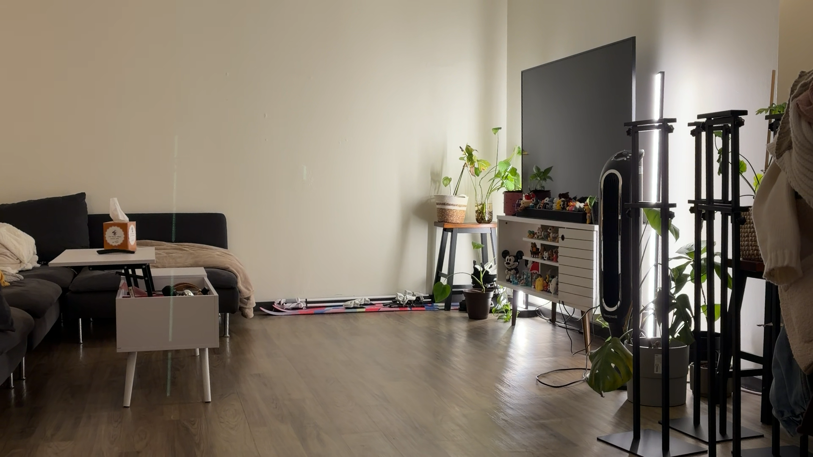
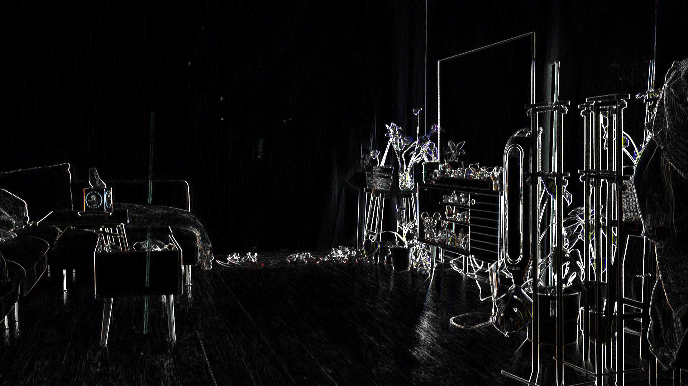
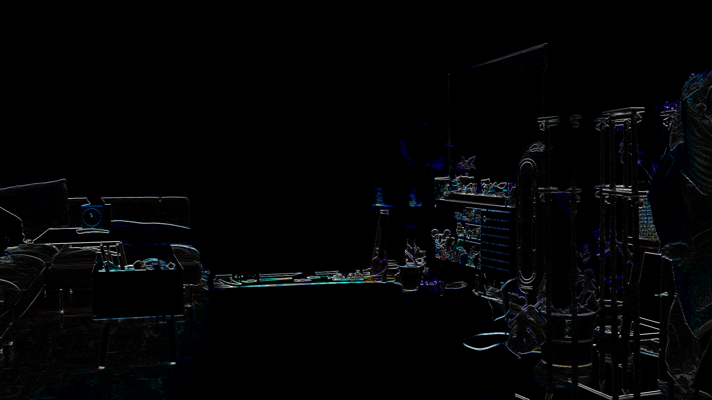
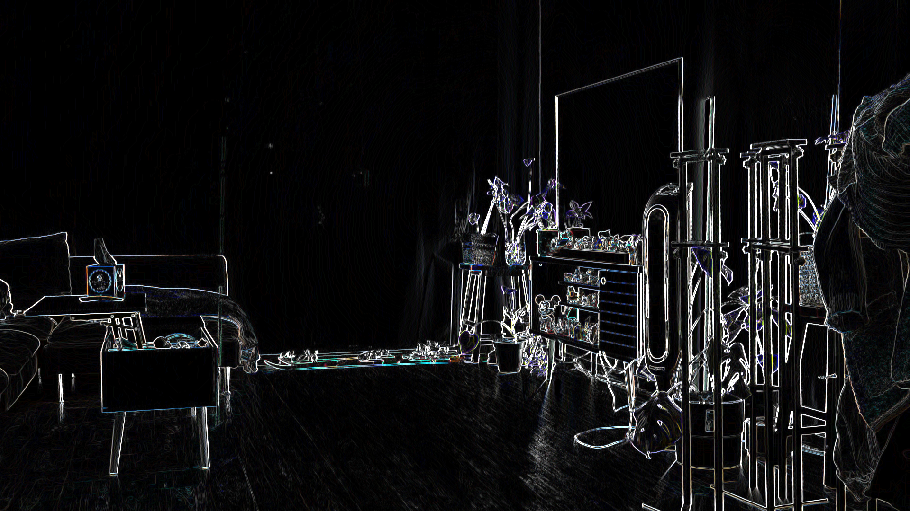
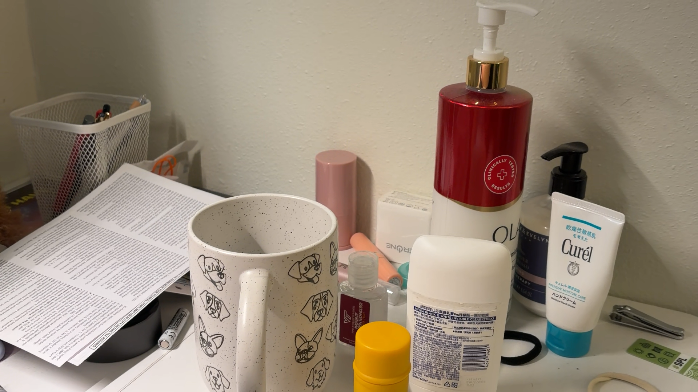
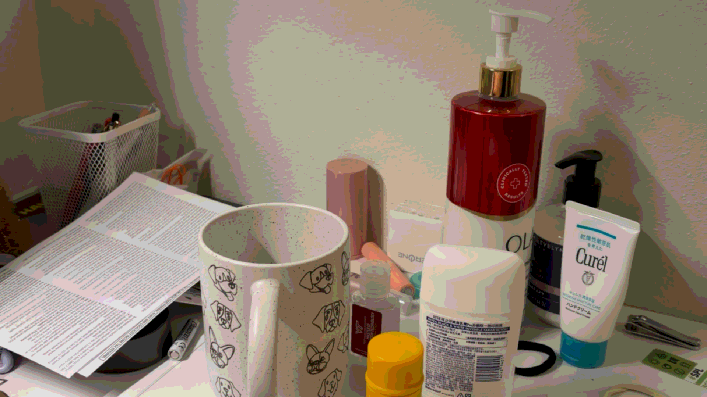
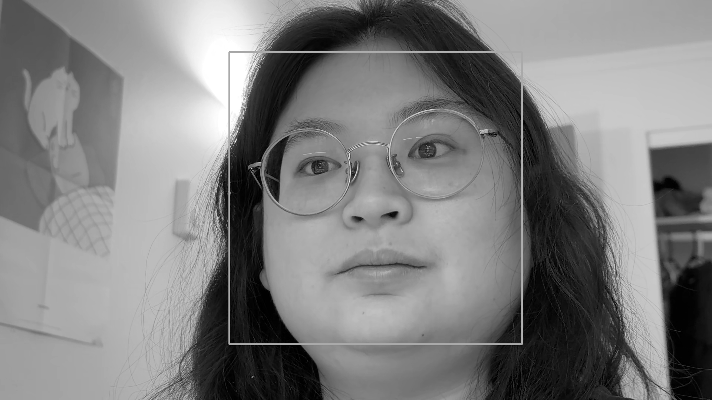

## How cvtColor work in OpenCV? (Task3)
OpenCV provides over 150 color-space coversion methods. We use the RGB -> Gray color coversion code(`cv::COLOR_RGB2GRAY`) in our project. The coversion is based on the formula listed belows. 

Transformations within RGB space like adding/removing the alpha channel, reversing the channel order, conversion to/from 16-bit RGB color (R5:G6:B5 or R5:G5:B5), as well as conversion to/from grayscale using:
$$Y \leftarrow 0.299 \cdot R + 0.587 \cdot G + 0.114 \cdot B$$
and
$$R \leftarrow Y, G \leftarrow Y, B \leftarrow Y, A \leftarrow \max(ChannelRange)$$

The original and `cvtColor::COLOR_RGB2GRAY` version images are listed below:
**Color:**

**Grey:**

## Alternative grayscale filter (Task4)
We use weighted RGB mean for the filter. The weight is designed to mimic the true tonal perception of the human visual system. The coverison is listed below:
$$Y \leftarrow  0.32  \cdot R + 0.64 \cdot G + 0.04 \cdot B$$

**Color:**

**Our gray filter:**

**CV's gray filter:**

## Sepia filter (Task5)
We declare two diffrent variable to store RGB information. One set of variable store orginal RGB information and the other store the RGB information after coversion.

**Original:**

**Apply Sepia filter:**

## 5x5 blur filter (Task6)
**Original:**

**Apply 5x5 blur:**

**Timing information:**

## 3x3 Sobel X and 3x3 Sobel Y (Task8)
We implment an abstract convolution function `int Filters::convolve(cv::Mat &src, cv::Mat &dst, int *kernel1, int *kernel2, int kSize, int kSum)` to process convolution with NxN seprable kernel. 

**Original:**

**Apply SobelX filter:**

**Apply SobelY filter:**

**Apply Gradient Magnitude:**

## Implement a function that blurs and quantizes a color image(Task9)

**Original:**

**Applied filter:**

## Face detection(Task10)
**Picture with face detection**

**Original:**

**Apply blurQuantize:**

## Face detection (Task10)

## Depth Anything V2 network (Task11)

## More effect (Task12)

### Remain yellow and grey everything else

**Original:**

**Apply filter:**

